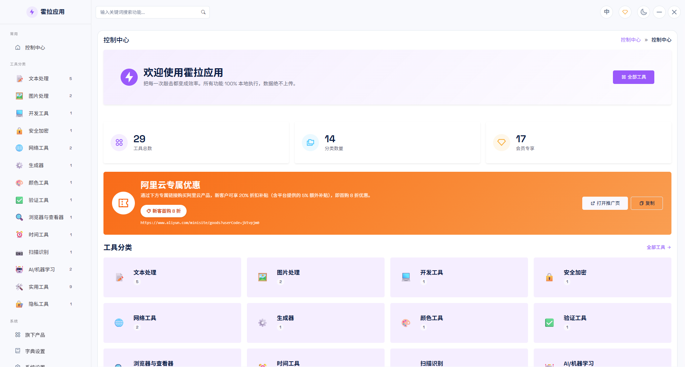
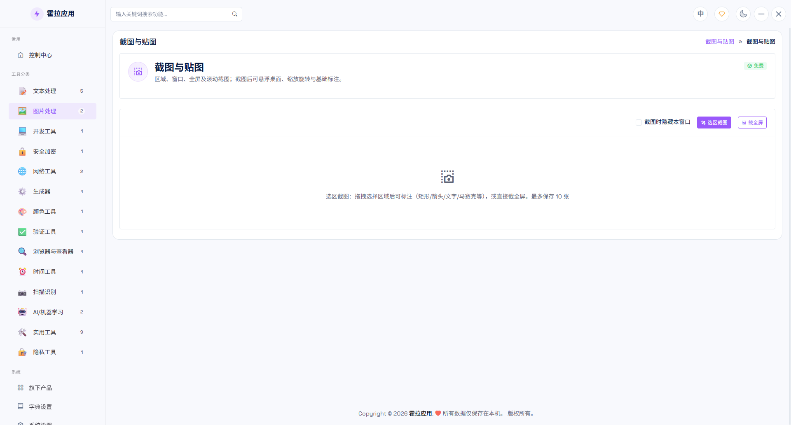

# 霍拉应用（Hola Apps）

> 本地优先的 Windows 效率工具箱 · **27 个工具** · 数据仅存本机，绝不上传

English: [`README.en.md`](./README.en.md)

## 简介

霍拉应用是一款为 Windows 打造的纯本地效率工具合集，聚焦剪贴板、采集、文件、系统与网络五大场景。命令面板与快捷键驱动，托盘常驻、随叫随到，安装即用、打开即用，**离线可用**。

**本仓库仅发布生产打包文件**（见 [Releases](https://github.com/apphola-com/apphola/releases)），不含源码。

---

## 📸 界面截图

> 截图存放于 [`screenshots/`](./screenshots/) 目录。请按以下文件名将对应截图放入该目录（发布前务必替换为真实截图，图片仅供参考）。

<em>主界面 · 27 个工具总览</em>

<em>代表性工具操作面板示例</em>

<em>会员登录与会员功能解锁</em>

---

## ✨ 功能特性

27 个工具按五大类别组织（★ = 会员专属功能，登录账号即可解锁）：

### 输入 · Input
- 剪贴板历史
- 代码片段管理
- 桌面便签
- ★ 文本工具箱
- ★ 正则表达式测试
- ★ 文本对比

### 采集 · Capture
- 截图标注
- 快速查看
- 取色器
- ★ OCR 文字识别

### 窗口 · Window
- 全局快捷键
- 系统监控
- 系统报告
- Spotlight 快速启动
- ★ 番茄钟

### 文件 · File
- 哈希校验
- ★ 批量重命名
- ★ 图片处理
- ★ 重复文件查找
- ★ 隐私清理
- ★ 自动化
- ★ 文件加密
- ★ 备份

### 网络 · Network
- 定时任务
- ★ 局域网快传
- ★ 二维码生成
- ★ 端口扫描

---

## 🚀 下载与安装

1. 前往 [Releases](https://github.com/apphola-com/apphola/releases) 页面。
2. 下载最新版本的安装包（`*.exe` 或 `*.msi`）。
3. 运行安装包完成安装；首次运行如需 WebView2 运行时会自动引导安装。

> 安装包为 **生产打包（Release）构建**，仅包含最终产物。

---

## 🖥 系统要求

- **操作系统**：Windows 10（1703 以上）或 Windows 11
- **架构**：x64
- **运行时**：Microsoft Edge WebView2（可自动安装）

---

## 🔐 会员说明

- 免费用户可使用全部基础工具。
- 标记为 **★ 会员专属** 的工具/能力，需**登录账号、处于会员有效期**后解锁。
- 会员状态本地校验、离线可用；账号与会员数据同样仅保存在本机。

---

## 🔒 隐私与本地优先

- 所有工具均在本地执行，**无需联网**也可使用核心功能。
- 数据（剪贴板、便签、配置等）仅存储在本机，**绝不上传云端**。

---

## 支持与反馈

如有问题或建议，请在 [Issues](https://github.com/apphola-com/apphola/issues) 中反馈。